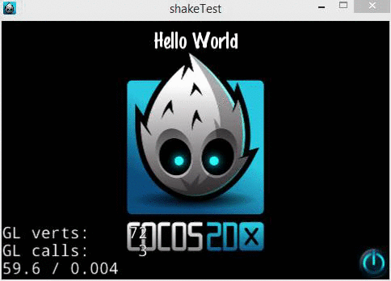

#Cocos2d-x Shake 

Hello this is an example of the the tutorial of the user [Joseph39](http://discuss.cocos2d-x.org/users/Joseph39/)

For a complete details about this please go to the cocos2d-x forums.
Go here
[http://discuss.cocos2d-x.org/t/cocos2d-camera-shake-effect-from-unity-tutorial/27215](http://discuss.cocos2d-x.org/t/cocos2d-camera-shake-effect-from-unity-tutorial/27215)
#Demo
